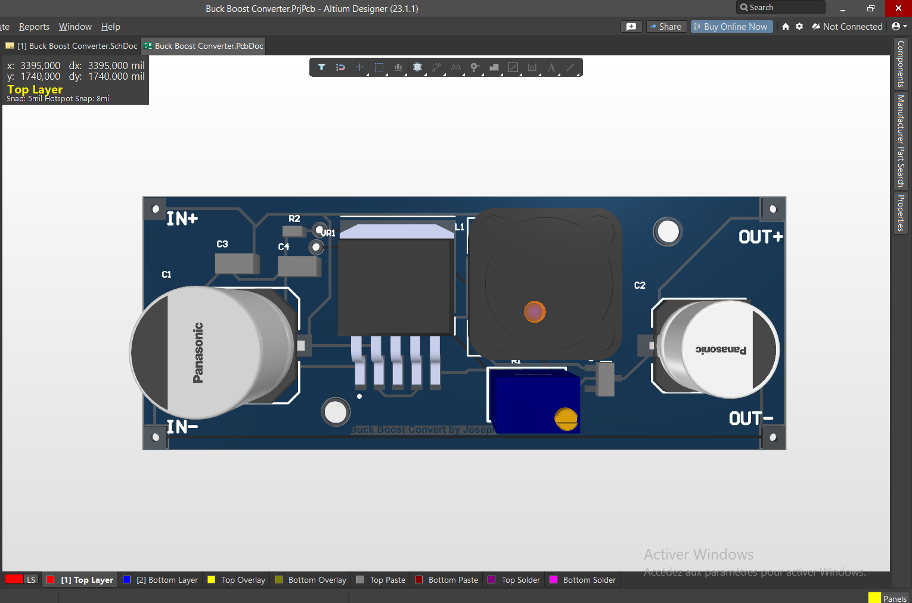
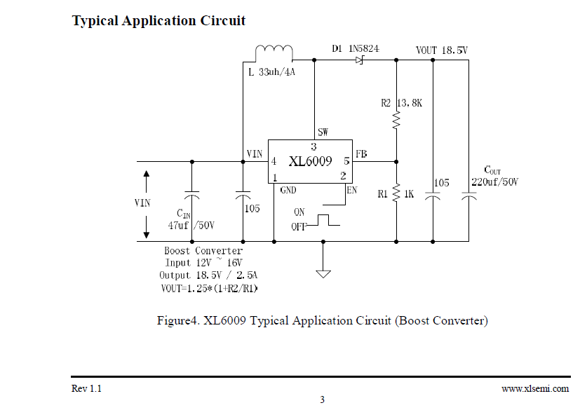
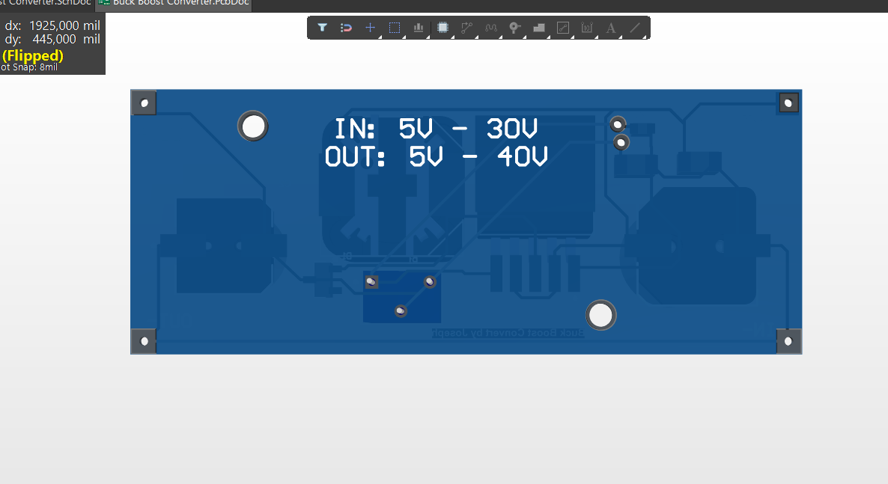
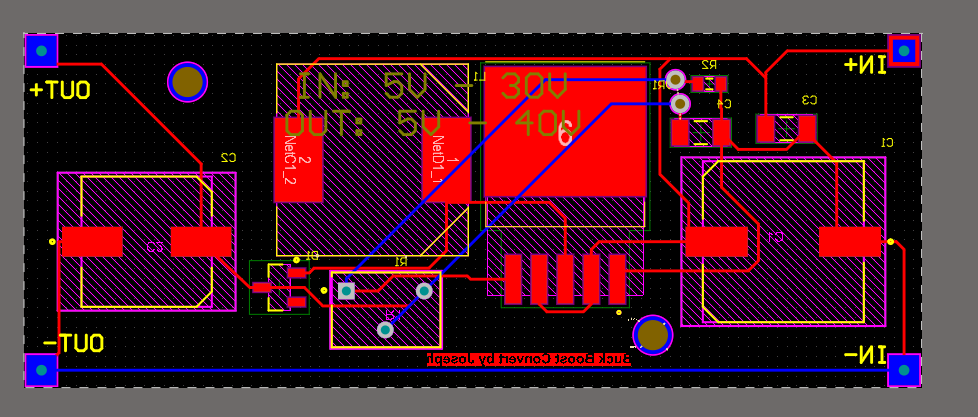
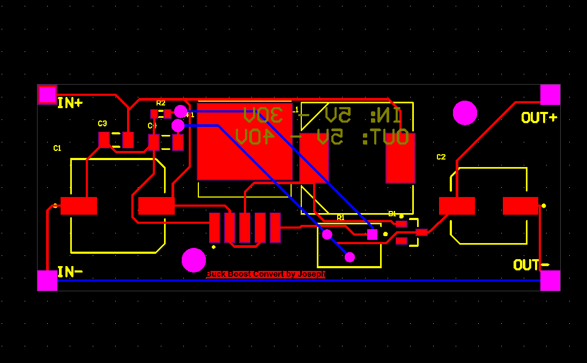
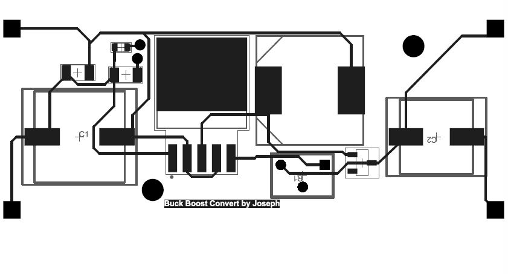

# Convertisseur Boost réglable basé sur XL6009

## Convertisseur DC-DC élévateur avec tension de sortie ajustable



Projet de conception d’un convertisseur DC-DC **Boost** basé sur le contrôleur **XL6009**. Le circuit permet d’élever une tension continue d’entrée vers une tension de sortie supérieure et réglable à l’aide d’un potentiomètre multitours.

Le projet comprend l’étude fonctionnelle, le schéma électronique, le PCB conçu sous Altium Designer, les exports visuels, le modèle 3D STEP, les sources Altium et les documents associés.

---

## Vue d’ensemble

| Paramètre | Description |
|---|---|
| Topologie | Convertisseur DC-DC Boost |
| Contrôleur principal | XL6009 |
| Fonction | Élévation d’une tension DC d’entrée vers une tension de sortie supérieure |
| Réglage de sortie | Potentiomètre multitours sur le réseau de feedback |
| Inductance | 47 µH — DR125-470-R |
| Diode | BAT17 / diode Schottky rapide |
| Outil de conception | Altium Designer |
| Modèle mécanique | STEP 3D |
| Domaine | Électronique de puissance et conception PCB |

---

## Objectif

L’objectif est de concevoir une carte capable de fournir une tension de sortie **supérieure à la tension d’entrée**, avec une régulation ajustable.

Ce type de convertisseur est utile lorsqu’une source basse tension doit alimenter une charge nécessitant une tension plus élevée, par exemple :

- Modules ou périphériques alimentés à une tension supérieure.
- Étages analogiques ou capteurs nécessitant une marge de tension.
- Prototypes embarqués alimentés par batterie ou alimentation DC limitée.
- Systèmes nécessitant une tension de sortie réglable.

---

## Principe de fonctionnement

Le circuit utilise le XL6009 comme contrôleur de conversion à découpage.

### Phase de stockage d’énergie

Lorsque le commutateur interne du XL6009 est fermé :

- Le courant augmente dans l’inductance `L1`.
- L’inductance stocke de l’énergie sous forme de champ magnétique.
- La diode empêche la sortie de se décharger vers l’entrée.

### Phase de transfert d’énergie

Lorsque le commutateur interne s’ouvre :

- L’inductance s’oppose à la variation de courant.
- Sa tension s’ajoute à la tension d’entrée.
- L’énergie est transférée à travers la diode vers la sortie.
- Le condensateur de sortie filtre la tension obtenue.

Ainsi, la tension de sortie devient supérieure à la tension d’entrée.

---

## Composants principaux

| Référence | Composant | Fonction |
|---|---|---|
| `VR1` | XL6009 | Contrôleur DC-DC à découpage |
| `L1` | DR125-470-R — 47 µH | Stockage et transfert d’énergie |
| `D1` | BAT17 / diode Schottky | Redressement rapide vers la sortie |
| `C1` | Condensateur d’entrée | Filtrage de l’entrée |
| `C2` | Condensateur de sortie | Réduction de l’ondulation de sortie |
| `R2` | 330 Ω | Partie fixe du pont de feedback |
| `VR2` | 3266W-1-103LF — 10 kΩ | Réglage de la tension de sortie |

---

## Régulation de la tension de sortie

La tension de sortie est contrôlée par la broche de feedback `FB` du XL6009.

Le réseau de régulation est constitué de :

- Une résistance fixe `R2 = 330 Ω`.
- Un potentiomètre multitours `VR2 = 10 kΩ`.

Le XL6009 ajuste son rapport cyclique PWM afin de maintenir sa tension de référence interne sur la broche `FB`. En modifiant le potentiomètre, le rapport du pont diviseur change, ce qui ajuste la tension de sortie.

Cette approche permet de régler la sortie selon les besoins de l’application.

---

## Schéma électronique

L’image suivante présente le schéma associé au contrôleur XL6009 et à l’étage Boost.



Les documents de référence sont disponibles ici :

- [Documentation du projet](docs/Buck%20Boost%20Converter.pdf)
- [Documentation typon / PCB](docs/tyon.pdf)
- [Datasheet XL6009](docs/XL6009.PDF)

---

## Conception PCB

Le PCB a été conçu sous Altium Designer. Il comprend les borniers d’entrée et de sortie, le contrôleur XL6009, l’inductance, la diode, le potentiomètre de réglage, les condensateurs de filtrage et les réseaux de feedback.

### Rendu 3D — face supérieure


### Rendu 3D — face inférieure



### Couche cuivre supérieure



### Couche cuivre inférieure



---

## Typon et documentation PCB

Le typon ou aperçu de fabrication du PCB est disponible ci-dessous :



La documentation PDF associée est disponible ici :

- [Ouvrir le PDF du typon](docs/tyon.pdf)

---

## Modèle 3D STEP

Un modèle 3D de la carte a été exporté au format STEP, afin de permettre une intégration mécanique dans un boîtier, un support ou un assemblage mécatronique.

- [Télécharger le modèle 3D STEP](hardware/exports/Buck%20Boost%20Converter.step)

Le fichier peut être ouvert dans des logiciels tels que FreeCAD, SolidWorks ou Fusion 360.

---

## Sources Altium

Les fichiers sources Altium sont conservés dans le dossier [`hardware/source-files`](hardware/source-files).

| Fichier | Rôle |
|---|---|
| [`Buck Boost Converter.PrjPcb`](hardware/source-files/Buck%20Boost%20Converter.PrjPcb) | Fichier principal du projet Altium |
| [`Buck Boost Converter.SchDoc`](hardware/source-files/Buck%20Boost%20Converter.SchDoc) | Schéma électronique |
| [`Buck Boost Converter.PcbDoc`](hardware/source-files/Buck%20Boost%20Converter.PcbDoc) | Layout PCB |
| [`Buck Boost Converter.IntLib`](hardware/source-files/Buck%20Boost%20Converter.IntLib) | Bibliothèque intégrée |
| [`Buck Boost Converter.PrjPcbStructure`](hardware/source-files/Buck%20Boost%20Converter.PrjPcbStructure) | Structure du projet Altium |

---

## Archive du projet

Une archive RAR de sauvegarde du projet complet est disponible :

- [Télécharger l’archive complète du projet](archive/Buck%20Boost%20Converter.rar)

> L’archive est fournie comme sauvegarde. Pour consulter ou modifier le design, il est préférable d’utiliser directement les fichiers sources Altium du dossier `hardware/source-files/`.

---

## Structure du repository

```text
.
├── archive/
│   └── Buck Boost Converter.rar
│
├── assets/
│   └── images/
│       ├── boost-pcb-3d-bottom.png
│       ├── boost-pcb-3d-top.png
│       ├── boost-pcb-bottom-copper.png
│       ├── boost-pcb-top-copper.png
│       ├── typon.png
│       └── XL6009.png
│
├── docs/
│   ├── Buck Boost Converter.pdf
│   ├── tyon.pdf
│   └── XL6009.PDF
│
├── hardware/
│   ├── exports/
│   │   └── Buck Boost Converter.step
│   │
│   ├── manufacturing/
│   │   └── Fichiers de fabrication à compléter ou vérifier
│   │
│   └── source-files/
│       ├── Buck Boost Converter.IntLib
│       ├── Buck Boost Converter.PcbDoc
│       ├── Buck Boost Converter.PrjPcb
│       ├── Buck Boost Converter.PrjPcbStructure
│       └── Buck Boost Converter.SchDoc
│
└── README.md
```

---

## État du projet

**Conception électronique et PCB réalisés.**

Le repository contient le schéma, les rendus du PCB, la documentation du XL6009, le modèle STEP, les sources Altium et une archive de sauvegarde du projet.

Les prochaines étapes possibles sont :

- [ ] Vérifier les règles DRC dans Altium.
- [ ] Générer ou vérifier les fichiers Gerber et de perçage.
- [ ] Fabriquer une première révision du PCB.
- [ ] Vérifier la plage de tension de sortie réglable.
- [ ] Mesurer l’ondulation de sortie.
- [ ] Mesurer le rendement selon la charge.
- [ ] Vérifier l’échauffement du XL6009, de l’inductance et de la diode.
- [ ] Ajouter des résultats de tests au repository.

---

## Compétences mobilisées

- Électronique de puissance.
- Convertisseur DC-DC Boost.
- Régulation par feedback.
- PWM et topologies à découpage.
- Dimensionnement d’inductances et condensateurs.
- Utilisation d’un potentiomètre dans une boucle de régulation.
- Conception de schéma électronique.
- Altium Designer.
- Routage PCB.
- Export STEP et intégration mécanique.
- Documentation technique et organisation de projet GitHub.

---

## Auteur

**Joseph Mbode**

Ingénieur systèmes embarqués, électronique et conception de cartes électroniques.

- LinkedIn : [Joseph Mbode](https://www.linkedin.com/in/joseph-mbode)
- GitHub : [@Josephulrich](https://github.com/Josephulrich)
